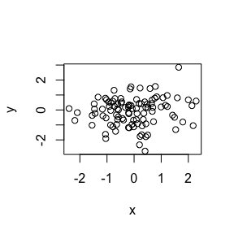

Cm004
================

This is a level one header
==========================

This is a level two header
--------------------------

This is a line of text.

-   bullet 1
-   bullet 2

``` r
x <- rnorm(100)
y <- rnorm(100)
plot(x,y)
```



``` r
summary(x)
```

    ##     Min.  1st Qu.   Median     Mean  3rd Qu.     Max. 
    ## -2.40000 -0.71080 -0.09770 -0.04069  0.50380  2.28900

``` r
x <- rnorm(100)
```
