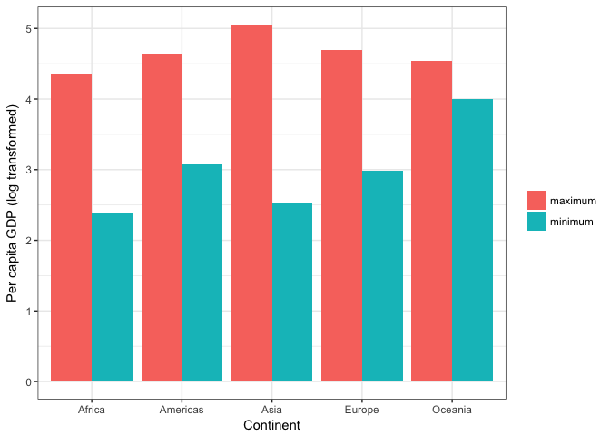

Gapminder\_exploration\_cont
================

Load the data
-------------

``` r
library(gapminder)
library(tidyverse)
```

    ## Loading tidyverse: ggplot2
    ## Loading tidyverse: tibble
    ## Loading tidyverse: tidyr
    ## Loading tidyverse: readr
    ## Loading tidyverse: purrr
    ## Loading tidyverse: dplyr

    ## Conflicts with tidy packages ----------------------------------------------

    ## filter(): dplyr, stats
    ## lag():    dplyr, stats

``` r
library(reshape2)
```

    ## 
    ## Attaching package: 'reshape2'

    ## The following object is masked from 'package:tidyr':
    ## 
    ##     smiths

Maximum and minimum GDP per capita
----------------------------------

``` r
mmGDP <- gapminder %>% 
          group_by(continent) %>%
            summarise(max.GDP= max(gdpPercap), min.GDP= min(gdpPercap)) %>%
              arrange(max.GDP)

knitr::kable(mmGDP, digits=0, col.names=c("Continent","Maximum per capita GDP","Minimum per capita GDP"))
```

| Continent |  Maximum per capita GDP|  Minimum per capita GDP|
|:----------|-----------------------:|-----------------------:|
| Africa    |                   21951|                     241|
| Oceania   |                   34435|                   10040|
| Americas  |                   42952|                    1202|
| Europe    |                   49357|                     974|
| Asia      |                  113523|                     331|

Africa has the lowest maximum and minimum per capita GDP. Asia has the highest per capita GDP, but it also the greatest range in GDP values, which indicates a large disparity in GDP between countries. I'll examine the range in per capita GDP within continents visually:

``` r
mmGDP.plot <- melt(mmGDP, id="continent") # reshape the data in order to plot min and max within continents on the same plot

ggplot(mmGDP.plot, aes(x=continent, y=log10(value), fill=variable)) + 
            geom_bar(position="dodge", stat="identity") + 
            ylab("Per capita GDP (log transformed)") + xlab("Continent") +
            scale_fill_discrete(name="", labels=c("maximum","minimum"))+
            theme_classic()
```



The ggplot confirms that Asia has the greatest range in per capita GDP. The range of GDP in Oceania is much smaller than in the other continents.

**Comments on the process**

I had trouble finding how to rename the columns in the kable table, I used code from Kozp's [Homework 2](https://github.com/Kozp/STAT545-hw-Kozik-Pavel/blob/Side-Branch/hw02/hw2.md) to help. For the ggplot, I intitially tried to create two bars for minimum and maximum using variations of 'position=dodge'. I couldn't get that to work, but noticed that the 'fill' function produced the plot I wanted as shown [here](http://ggplot2.tidyverse.org/reference/position_dodge.html). I learned how to use the reshape function from [this](http://www.statmethods.net/management/reshape.html) QuickR page.
