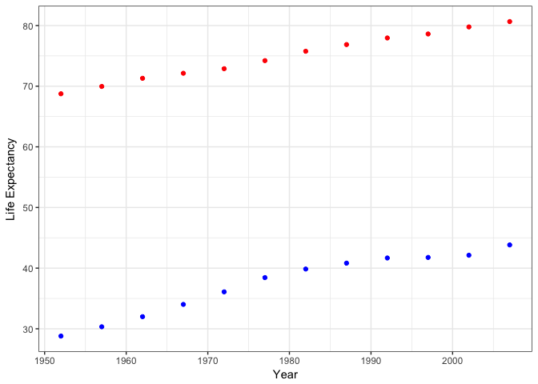

Gapminder Merges and Joins
================

Data Reshaping
--------------

I'm going to reshape the gapminder data so that there is one row per year and columns for life expectancy for two or more countries.

``` r
suppressPackageStartupMessages(library(tidyverse))
suppressPackageStartupMessages(library(gapminder))
```

First, I will create a reduced dataset with two countries (Afghanistan and Canada) and their life expectancy in each year.

``` r
gap.long <- gapminder %>% 
              select(year, country, lifeExp) %>%
                  filter(country=="Afghanistan"| country=="Canada")
```

Now I will spread the dataframe so each country has a seperate column with life expectancy.

``` r
gap.spread <- spread(gap.long, country, lifeExp)
knitr::kable(gap.spread, digits=0, col.names = c("Year","Afghanistan","Canada"))
```

|  Year|  Afghanistan|  Canada|
|-----:|------------:|-------:|
|  1952|           29|      69|
|  1957|           30|      70|
|  1962|           32|      71|
|  1967|           34|      72|
|  1972|           36|      73|
|  1977|           38|      74|
|  1982|           40|      76|
|  1987|           41|      77|
|  1992|           42|      78|
|  1997|           42|      79|
|  2002|           42|      80|
|  2007|           44|      81|

And now a scatterplot of this data.

``` r
ggplot(gap.spread, aes(x=year)) + 
  geom_point(aes(y=Afghanistan), col="blue") +
    geom_point(aes(y=Canada), col="red") +
      xlab("Year") + ylab("Life Expectancy") + theme_bw() 
```



The life expectancy of Canada (red) and Afganistan (blue) are shown above. Both have increased over time but life expectancy in Canada is 40 years greater than Afghanistan on average.

Let's gather the data back to it's original format for fun.

``` r
gap.gather <- gather(gap.spread, "country","lifeExp", 2:3)
knitr::kable(gap.gather, digits=0, col.names = c("Year","Country","Life Expectancy"))
```

|  Year| Country     |  Life Expectancy|
|-----:|:------------|----------------:|
|  1952| Afghanistan |               29|
|  1957| Afghanistan |               30|
|  1962| Afghanistan |               32|
|  1967| Afghanistan |               34|
|  1972| Afghanistan |               36|
|  1977| Afghanistan |               38|
|  1982| Afghanistan |               40|
|  1987| Afghanistan |               41|
|  1992| Afghanistan |               42|
|  1997| Afghanistan |               42|
|  2002| Afghanistan |               42|
|  2007| Afghanistan |               44|
|  1952| Canada      |               69|
|  1957| Canada      |               70|
|  1962| Canada      |               71|
|  1967| Canada      |               72|
|  1972| Canada      |               73|
|  1977| Canada      |               74|
|  1982| Canada      |               76|
|  1987| Canada      |               77|
|  1992| Canada      |               78|
|  1997| Canada      |               79|
|  2002| Canada      |               80|
|  2007| Canada      |               81|

**Comments on the Process**

This one was hard for me. Gather and spread are not my friends yet! I ended up partly using the cheatsheet mentioned in the last line of this document, but mostly through brute force trial and error. I also had trouble adding a legend to my scatterplot, I know that legends only get added automatically for aesthetic mappings, but I couldn't do that with the data in this format. I tried adding the legend manually but abondoned that. I'm interested to see other people's code.

Join, Merge, Look up
--------------------

I'm going to create a new dataframe with one row per country, the average life expectancy in that country, and the country code.

First, I will reduce the dataframe to one observation of life expectancy per country.

``` r
gap.le <- gapminder %>% 
             group_by(country) %>%
                summarise(m.LifeExp = mean(lifeExp))
```

Now, I will use a dataframe from the countrycode package with countrycodes for all the countries in my new gapminder dataset.

``` r
library(countrycode)
conco <- countrycode_data %>% 
            select(country.name.en, iso3c) %>% 
              rename(country=country.name.en) # rename to match gapminder dataframe
```

Finally, I will join the two dataframes together. (I'm not worried about the warning message, I want country to be treated as a character in both dataframes.)

``` r
gap.conco <- left_join(gap.le, conco, by="country")
```

    ## Warning: Column `country` joining factor and character vector, coercing
    ## into character vector

``` r
gap.conco <- select(gap.conco, country, iso3c, m.LifeExp) # rearrange columns

knitr::kable(gap.conco, digits=0, col.names = c("Country","Country Code", "Mean Life Expectancy"))
```

| Country                  | Country Code |  Mean Life Expectancy|
|:-------------------------|:-------------|---------------------:|
| Afghanistan              | AFG          |                    37|
| Albania                  | ALB          |                    68|
| Algeria                  | DZA          |                    59|
| Angola                   | AGO          |                    38|
| Argentina                | ARG          |                    69|
| Australia                | AUS          |                    75|
| Austria                  | AUT          |                    73|
| Bahrain                  | BHR          |                    66|
| Bangladesh               | BGD          |                    50|
| Belgium                  | BEL          |                    74|
| Benin                    | BEN          |                    49|
| Bolivia                  | NA           |                    53|
| Bosnia and Herzegovina   | BIH          |                    68|
| Botswana                 | BWA          |                    55|
| Brazil                   | BRA          |                    62|
| Bulgaria                 | BGR          |                    70|
| Burkina Faso             | BFA          |                    45|
| Burundi                  | BDI          |                    45|
| Cambodia                 | KHM          |                    48|
| Cameroon                 | CMR          |                    48|
| Canada                   | CAN          |                    75|
| Central African Republic | CAF          |                    44|
| Chad                     | TCD          |                    47|
| Chile                    | CHL          |                    67|
| China                    | CHN          |                    62|
| Colombia                 | COL          |                    64|
| Comoros                  | COM          |                    52|
| Congo, Dem. Rep.         | NA           |                    45|
| Congo, Rep.              | NA           |                    53|
| Costa Rica               | CRI          |                    70|
| Cote d'Ivoire            | NA           |                    48|
| Croatia                  | HRV          |                    70|
| Cuba                     | CUB          |                    71|
| Czech Republic           | CZE          |                    72|
| Denmark                  | DNK          |                    74|
| Djibouti                 | DJI          |                    46|
| Dominican Republic       | DOM          |                    62|
| Ecuador                  | ECU          |                    63|
| Egypt                    | EGY          |                    56|
| El Salvador              | SLV          |                    60|
| Equatorial Guinea        | GNQ          |                    43|
| Eritrea                  | ERI          |                    46|
| Ethiopia                 | ETH          |                    44|
| Finland                  | FIN          |                    73|
| France                   | FRA          |                    74|
| Gabon                    | GAB          |                    51|
| Gambia                   | NA           |                    44|
| Germany                  | DEU          |                    73|
| Ghana                    | GHA          |                    52|
| Greece                   | GRC          |                    74|
| Guatemala                | GTM          |                    57|
| Guinea                   | GIN          |                    43|
| Guinea-Bissau            | NA           |                    39|
| Haiti                    | HTI          |                    50|
| Honduras                 | HND          |                    58|
| Hong Kong, China         | NA           |                    73|
| Hungary                  | HUN          |                    69|
| Iceland                  | ISL          |                    77|
| India                    | IND          |                    53|
| Indonesia                | IDN          |                    54|
| Iran                     | NA           |                    59|
| Iraq                     | IRQ          |                    57|
| Ireland                  | IRL          |                    73|
| Israel                   | ISR          |                    74|
| Italy                    | ITA          |                    74|
| Jamaica                  | JAM          |                    69|
| Japan                    | JPN          |                    75|
| Jordan                   | JOR          |                    60|
| Kenya                    | KEN          |                    53|
| Korea, Dem. Rep.         | NA           |                    64|
| Korea, Rep.              | NA           |                    65|
| Kuwait                   | KWT          |                    69|
| Lebanon                  | LBN          |                    66|
| Lesotho                  | LSO          |                    50|
| Liberia                  | LBR          |                    42|
| Libya                    | LBY          |                    59|
| Madagascar               | MDG          |                    48|
| Malawi                   | MWI          |                    43|
| Malaysia                 | MYS          |                    64|
| Mali                     | MLI          |                    43|
| Mauritania               | MRT          |                    52|
| Mauritius                | MUS          |                    65|
| Mexico                   | MEX          |                    65|
| Mongolia                 | MNG          |                    56|
| Montenegro               | MNE          |                    70|
| Morocco                  | MAR          |                    58|
| Mozambique               | MOZ          |                    40|
| Myanmar                  | MMR          |                    53|
| Namibia                  | NAM          |                    53|
| Nepal                    | NPL          |                    49|
| Netherlands              | NLD          |                    76|
| New Zealand              | NZL          |                    74|
| Nicaragua                | NIC          |                    58|
| Niger                    | NER          |                    45|
| Nigeria                  | NGA          |                    44|
| Norway                   | NOR          |                    76|
| Oman                     | OMN          |                    58|
| Pakistan                 | PAK          |                    55|
| Panama                   | PAN          |                    68|
| Paraguay                 | PRY          |                    67|
| Peru                     | PER          |                    59|
| Philippines              | PHL          |                    61|
| Poland                   | POL          |                    70|
| Portugal                 | PRT          |                    70|
| Puerto Rico              | PRI          |                    73|
| Reunion                  | REU          |                    67|
| Romania                  | ROU          |                    68|
| Rwanda                   | RWA          |                    41|
| Sao Tome and Principe    | STP          |                    58|
| Saudi Arabia             | SAU          |                    59|
| Senegal                  | SEN          |                    51|
| Serbia                   | SRB          |                    69|
| Sierra Leone             | SLE          |                    37|
| Singapore                | SGP          |                    71|
| Slovak Republic          | NA           |                    71|
| Slovenia                 | SVN          |                    72|
| Somalia                  | SOM          |                    41|
| South Africa             | ZAF          |                    54|
| Spain                    | ESP          |                    74|
| Sri Lanka                | LKA          |                    67|
| Sudan                    | SDN          |                    48|
| Swaziland                | SWZ          |                    49|
| Sweden                   | SWE          |                    76|
| Switzerland              | CHE          |                    76|
| Syria                    | NA           |                    61|
| Taiwan                   | NA           |                    70|
| Tanzania                 | NA           |                    48|
| Thailand                 | THA          |                    62|
| Togo                     | TGO          |                    51|
| Trinidad and Tobago      | TTO          |                    67|
| Tunisia                  | TUN          |                    61|
| Turkey                   | TUR          |                    60|
| Uganda                   | UGA          |                    48|
| United Kingdom           | NA           |                    74|
| United States            | NA           |                    73|
| Uruguay                  | URY          |                    71|
| Venezuela                | NA           |                    67|
| Vietnam                  | NA           |                    57|
| West Bank and Gaza       | NA           |                    60|
| Yemen, Rep.              | NA           |                    47|
| Zambia                   | ZMB          |                    46|
| Zimbabwe                 | ZWE          |                    53|

You'll notice there are NAs for Country Code when there was no country in the 'conco' dataframe corresponding to country in the 'gap.le' dataframe.

``` r
# Countries with NA in the joined dataset:
filter(gap.conco, is.na(iso3c))
```

    ## # A tibble: 20 x 3
    ##               country iso3c m.LifeExp
    ##                 <chr> <chr>     <dbl>
    ##  1            Bolivia  <NA>  52.50458
    ##  2   Congo, Dem. Rep.  <NA>  44.54375
    ##  3        Congo, Rep.  <NA>  52.50192
    ##  4      Cote d'Ivoire  <NA>  48.43617
    ##  5             Gambia  <NA>  44.40058
    ##  6      Guinea-Bissau  <NA>  39.21025
    ##  7   Hong Kong, China  <NA>  73.49283
    ##  8               Iran  <NA>  58.63658
    ##  9   Korea, Dem. Rep.  <NA>  63.60733
    ## 10        Korea, Rep.  <NA>  65.00100
    ## 11    Slovak Republic  <NA>  70.69608
    ## 12              Syria  <NA>  61.34617
    ## 13             Taiwan  <NA>  70.33667
    ## 14           Tanzania  <NA>  47.91233
    ## 15     United Kingdom  <NA>  73.92258
    ## 16      United States  <NA>  73.47850
    ## 17          Venezuela  <NA>  66.58067
    ## 18            Vietnam  <NA>  57.47950
    ## 19 West Bank and Gaza  <NA>  60.32867
    ## 20        Yemen, Rep.  <NA>  46.78042

``` r
# For example, in the conco dataframe Bolivia and Congo are named:
conco$country[grep("Bolivia", conco$country)]
```

    ## [1] "Bolivia (Plurinational State of)"

``` r
conco$country[grep("Congo", conco$country)]
```

    ## [1] "Congo"                            "Democratic Republic of the Congo"

As you can see these countries are in the countrycode dataframe they just have slightly different names. In order to fix this issue I think I would have to individually search the countrycode data for each of the countries with NA in the joined dataset and rename them. Any other suggestions?

**Comments on the Process**

My biggest challenge here was finding the countrycode data. The countrycode package has a function that would have converted country to countrycode directly in the gapminder dataset, which was a bit of a tease. By far my favourite reference for all things dplyr is now this [cheatsheet](https://www.rstudio.com/wp-content/uploads/2015/02/data-wrangling-cheatsheet.pdf).
