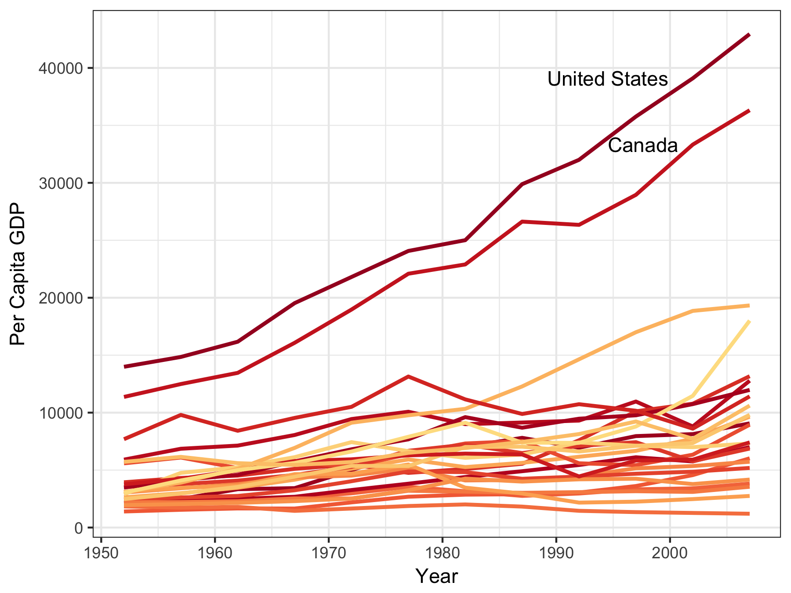

I will use the Gapminder data set for this assignment

```{r}
suppressPackageStartupMessages(library(gapminder))
suppressPackageStartupMessages(library(tidyverse))
suppressPackageStartupMessages(library(forcats))
```


## Factor Management

First, let's look at the data structure. 
```{r}
str(gapminder)
```

Continent is a factor.
```{r}
levels(gapminder$continent)
```

It has 5 levels. 

I'd like to **Drop Oceania** from the data frame and ensure that factor level is removed as well. 
```{r}
length(which(gapminder$continent == "Oceania")) # How many Oceania rows are there?

gapminder.no <- gapminder %>% 
                  filter(continent != "Oceania") 

length(which(gapminder.no$continent == "Oceania")) # How many Oceania rows are there now?
levels(gapminder.no$continent) # But how many factor levels?

```

There are still 5 factor levels even though Oceania has been removed.
```{r}
 gapminder.no$continent <-  gapminder.no$continent %>% 
                              fct_drop()
levels(gapminder.no$continent)
```

Now there are the correct factor levels.

I will now **reorder the levels of continent** based on the median per capita GDP within each country, in descending order.
```{r}
gapminder.no$continent <- fct_reorder(gapminder.no$continent, gapminder.no$gdpPercap, median, .desc = TRUE)
levels(gapminder.no$continent) 
```

This reorded the factor levels as I wanted, but let's see if the order of the data has changed:
```{r}
head(gapminder) # orginal data
head(gapminder.no) # reordered factor data
tail(gapminder) # orginal data
tail(gapminder.no) # reordered factor data
```

Nope. Both the orginal dataframe and the dataframe with the reorded factor levels are in the same order.

How does this differ from **arrange**?
```{r}
gapminder.noa <- gapminder %>%
                    filter(continent!= "Oceania") %>%
                      group_by(continent) %>%
                        mutate(med.gdp = median(gdpPercap)) %>%
                         arrange(desc(med.gdp)) 

gapminder.noa$continent <- fct_drop(gapminder.noa$continent)

head(gapminder.noa)
levels(gapminder.noa$continent)
```
With arrange the order of the data changes so it is now in the same order as the factor levels with fct_reorder() (starts with Europe), but the order of the factor levels do not change. 

Let's see whether the order of the data or the order of the factors dictate how this data is plotted. 
```{r}
ggplot(gapminder.noa, aes(x=continent, y=gdpPercap)) + 
      geom_boxplot() +
        theme_bw() + xlab("Continent") + ylab("Per Capita GDP")
```

Looks like it's the order of the factor levels that dictate plotting order. So if I wanted the same plot but in order of decreasing median GDP, I could use the dataframe I applied fct_reorder to.

```{r}
ggplot(gapminder.no, aes(x=continent, y=gdpPercap)) + 
      geom_boxplot() +
        theme_bw() + xlab("Continent") + ylab("Per Capita GDP")
```

Nice! :star:

## File I/O

I'll go back to using the original gapminder data and fiddle with factor levels so they start with Asia, then Europe, and after that I don't care about the order.
```{r}
gapminder$continent<- gapminder$continent %>% fct_relevel("Asia", "Europe")
levels(gapminder$continent)
```

Now I'll summarize the difference between the richest and poorest country in each continent over time.
```{r}
gapminder.range <-  gapminder %>% 
                      group_by(continent, year) %>%
                         summarise(rich.range = max(gdpPercap) - min(gdpPercap))
head(gapminder.range)
tail(gapminder.range)
```

As you can see, the data is ordered according the factor order for continent that I specified (starts with Asia, ends with Oceania.

Now, I'll export this data, but I want to preserve my hard-earned factor order.
```{r}
getwd() # where is this going to save to?
saveRDS(gapminder.range, "gapminder.range.rds")
```

The .rds file is now in my hw05-Factors folder. Now I'll read it back in but I'm going to call it something different so that I can compare the original dataframe and the outputed/inputed one.
```{r}
gapminder.range.in <- readRDS("gapminder.range.rds")
```

It's back! :boom: But were my factor levels preserved?
```{r}
levels(gapminder.range$continent)
levels(gapminder.range.in$continent)
```

Yup! :punch:

## Visualization design

In Homework 2 I made a plot I'm not that proud of:
```{r}
filter(gapminder, continent=="Americas") %>% 
  select(country, gdpPercap, year) %>%
  ggplot(aes(x=year, y=gdpPercap)) + geom_point(aes(colour=country), alpha=0.3) + geom_smooth() + theme_classic()
```

It's really difficult to distinguish between countries with so many colours in the plot. Tamara Munzer mentioned you should use a maximum of ~8 colours per plot so I don't think there is a colour scheme that would make each country easily distinguishable, but maybe I could simplify the plot instead. First, rather than points I'll use lines as the trend is the message I'm trying to get across. Then I'll drop the smoothed mean trend line (stat_smooth()) to de-clutter. Last, I'll focus on the two outlier countries that have increased in wealth exceptionally quickly by labelling them. 

```{r}
p <- gapminder %>% 
        filter(continent=="Americas") %>%
            ggplot(aes(x = year, y = gdpPercap)) +
              geom_line(aes(color=country),lwd=1, show.legend=FALSE) + scale_color_manual(values = country_colors) +
                theme_bw() + xlab("Year") + ylab("Per Capita GDP")
    
p <- p +  geom_text(data=subset(gapminder, country %in% c("Canada","United States") & year==2002), 
         aes(x=year, y=gdpPercap, label=country), hjust=1.2)
p            
```

I think this plot is much better. I'll export it. (Note to reviewers: the labels only worked when I used geom_text in a seperate step, I'd be interested to learn why.)
```{r}
ggsave(p, file="GDP_Americas.png", width=4, height=3, scale=1.5, dpi=300)
```

Here's the exported file, supersized, high res, and linked back into this document: 
