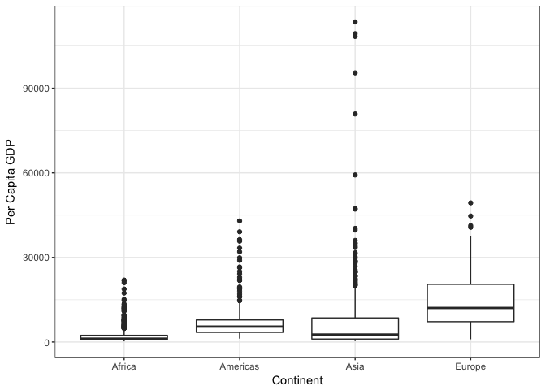
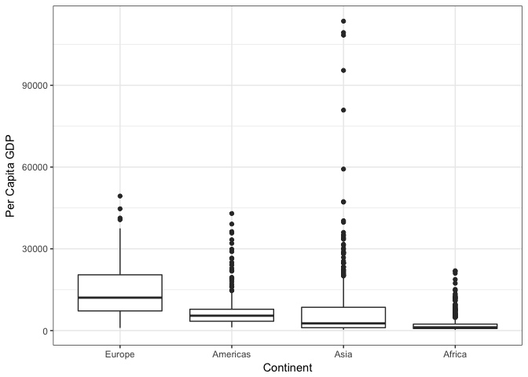

Factor and Figure Management
================

I will use the Gapminder data set for this assignment

``` r
suppressPackageStartupMessages(library(gapminder))
suppressPackageStartupMessages(library(tidyverse))
suppressPackageStartupMessages(library(forcats))
```

Factor Management
-----------------

First, let's look at the data structure.

``` r
str(gapminder)
```

    ## Classes 'tbl_df', 'tbl' and 'data.frame':    1704 obs. of  6 variables:
    ##  $ country  : Factor w/ 142 levels "Afghanistan",..: 1 1 1 1 1 1 1 1 1 1 ...
    ##  $ continent: Factor w/ 5 levels "Africa","Americas",..: 3 3 3 3 3 3 3 3 3 3 ...
    ##  $ year     : int  1952 1957 1962 1967 1972 1977 1982 1987 1992 1997 ...
    ##  $ lifeExp  : num  28.8 30.3 32 34 36.1 ...
    ##  $ pop      : int  8425333 9240934 10267083 11537966 13079460 14880372 12881816 13867957 16317921 22227415 ...
    ##  $ gdpPercap: num  779 821 853 836 740 ...

Continent is a factor.

``` r
levels(gapminder$continent)
```

    ## [1] "Africa"   "Americas" "Asia"     "Europe"   "Oceania"

It has 5 levels for each continent.

I'd like to **Drop Oceania** from the data frame and ensure that factor level is removed as well.

``` r
length(which(gapminder$continent == "Oceania")) # How many Oceania rows are there?
```

    ## [1] 24

``` r
gapminder.no <- gapminder %>% 
                  filter(continent != "Oceania") 

length(which(gapminder.no$continent == "Oceania")) # How many Oceania rows are there now?
```

    ## [1] 0

``` r
levels(gapminder.no$continent) # But how many factor levels?
```

    ## [1] "Africa"   "Americas" "Asia"     "Europe"   "Oceania"

There are still 5 factor levels even though Oceania has been removed.

``` r
 gapminder.no$continent <-  gapminder.no$continent %>% 
                              fct_drop()
levels(gapminder.no$continent) # Now how many factor levels?
```

    ## [1] "Africa"   "Americas" "Asia"     "Europe"

Now there are the correct number of factor levels.

I will now **reorder the levels of continent** based on the median per capita GDP within each country, in descending order.

``` r
gapminder.no$continent <- fct_reorder(gapminder.no$continent, gapminder.no$gdpPercap, median, .desc = TRUE)
levels(gapminder.no$continent) 
```

    ## [1] "Europe"   "Americas" "Asia"     "Africa"

This reorded the factor levels, but let's see if the order of the data has changed:

``` r
head(gapminder) # orginal data
```

    ## # A tibble: 6 x 6
    ##       country continent  year lifeExp      pop gdpPercap
    ##        <fctr>    <fctr> <int>   <dbl>    <int>     <dbl>
    ## 1 Afghanistan      Asia  1952  28.801  8425333  779.4453
    ## 2 Afghanistan      Asia  1957  30.332  9240934  820.8530
    ## 3 Afghanistan      Asia  1962  31.997 10267083  853.1007
    ## 4 Afghanistan      Asia  1967  34.020 11537966  836.1971
    ## 5 Afghanistan      Asia  1972  36.088 13079460  739.9811
    ## 6 Afghanistan      Asia  1977  38.438 14880372  786.1134

``` r
head(gapminder.no) # reordered factor data
```

    ## # A tibble: 6 x 6
    ##       country continent  year lifeExp      pop gdpPercap
    ##        <fctr>    <fctr> <int>   <dbl>    <int>     <dbl>
    ## 1 Afghanistan      Asia  1952  28.801  8425333  779.4453
    ## 2 Afghanistan      Asia  1957  30.332  9240934  820.8530
    ## 3 Afghanistan      Asia  1962  31.997 10267083  853.1007
    ## 4 Afghanistan      Asia  1967  34.020 11537966  836.1971
    ## 5 Afghanistan      Asia  1972  36.088 13079460  739.9811
    ## 6 Afghanistan      Asia  1977  38.438 14880372  786.1134

``` r
tail(gapminder) # orginal data
```

    ## # A tibble: 6 x 6
    ##    country continent  year lifeExp      pop gdpPercap
    ##     <fctr>    <fctr> <int>   <dbl>    <int>     <dbl>
    ## 1 Zimbabwe    Africa  1982  60.363  7636524  788.8550
    ## 2 Zimbabwe    Africa  1987  62.351  9216418  706.1573
    ## 3 Zimbabwe    Africa  1992  60.377 10704340  693.4208
    ## 4 Zimbabwe    Africa  1997  46.809 11404948  792.4500
    ## 5 Zimbabwe    Africa  2002  39.989 11926563  672.0386
    ## 6 Zimbabwe    Africa  2007  43.487 12311143  469.7093

``` r
tail(gapminder.no) # reordered factor data
```

    ## # A tibble: 6 x 6
    ##    country continent  year lifeExp      pop gdpPercap
    ##     <fctr>    <fctr> <int>   <dbl>    <int>     <dbl>
    ## 1 Zimbabwe    Africa  1982  60.363  7636524  788.8550
    ## 2 Zimbabwe    Africa  1987  62.351  9216418  706.1573
    ## 3 Zimbabwe    Africa  1992  60.377 10704340  693.4208
    ## 4 Zimbabwe    Africa  1997  46.809 11404948  792.4500
    ## 5 Zimbabwe    Africa  2002  39.989 11926563  672.0386
    ## 6 Zimbabwe    Africa  2007  43.487 12311143  469.7093

Nope! Both the orginal dataframe and the dataframe with the reorded factor levels start with Asian and end with Africa.

How does this differ from **arrange**?

``` r
gapminder.noa <- gapminder.no %>%
                    group_by(continent) %>%
                      mutate(med.gdp = median(gdpPercap)) %>%
                       arrange(desc(med.gdp))

head(gapminder.noa)
```

    ## # A tibble: 6 x 7
    ## # Groups:   continent [1]
    ##   country continent  year lifeExp     pop gdpPercap  med.gdp
    ##    <fctr>    <fctr> <int>   <dbl>   <int>     <dbl>    <dbl>
    ## 1 Albania    Europe  1952   55.23 1282697  1601.056 12081.75
    ## 2 Albania    Europe  1957   59.28 1476505  1942.284 12081.75
    ## 3 Albania    Europe  1962   64.82 1728137  2312.889 12081.75
    ## 4 Albania    Europe  1967   66.22 1984060  2760.197 12081.75
    ## 5 Albania    Europe  1972   67.69 2263554  3313.422 12081.75
    ## 6 Albania    Europe  1977   68.93 2509048  3533.004 12081.75

``` r
tail(gapminder.noa)
```

    ## # A tibble: 6 x 7
    ## # Groups:   continent [1]
    ##    country continent  year lifeExp      pop gdpPercap  med.gdp
    ##     <fctr>    <fctr> <int>   <dbl>    <int>     <dbl>    <dbl>
    ## 1 Zimbabwe    Africa  1982  60.363  7636524  788.8550 1192.138
    ## 2 Zimbabwe    Africa  1987  62.351  9216418  706.1573 1192.138
    ## 3 Zimbabwe    Africa  1992  60.377 10704340  693.4208 1192.138
    ## 4 Zimbabwe    Africa  1997  46.809 11404948  792.4500 1192.138
    ## 5 Zimbabwe    Africa  2002  39.989 11926563  672.0386 1192.138
    ## 6 Zimbabwe    Africa  2007  43.487 12311143  469.7093 1192.138

``` r
levels(gapminder.noa$continent)
```

    ## [1] "Europe"   "Americas" "Asia"     "Africa"

With arrange the order of the data changes, and the continents are listed in the same order as the factor levels with fct\_reorder() (starts with Europe ends with Africa), but the order of the factor levels do not change.

Let's see whether the order of the data or the order of the factors dictate how this data is plotted.

``` r
ggplot(gapminder.noa, aes(x=continent, y=gdpPercap)) + 
      geom_boxplot() +
        theme_bw() + xlab("Continent") + ylab("Per Capita GDP")
```

 Looks like it's the order of the factor levels that dictate plotting order. So if I wanted the same plot but in order of decreasing median GDP, I could use the dataframe I applied fct\_reorder to.

``` r
ggplot(gapminder.no, aes(x=continent, y=gdpPercap)) + 
      geom_boxplot() +
        theme_bw() + xlab("Continent") + ylab("Per Capita GDP")
```



Nice! :star:

File I/O
--------

I'll go back to using the original gapminder data and fiddle with factor levels so they start with Asia, then Europe and after that I don't care about the order.

``` r
gapminder$continent<- gapminder$continent %>% fct_relevel("Asia", "Europe")
levels(gapminder$continent)
```

    ## [1] "Asia"     "Europe"   "Africa"   "Americas" "Oceania"

Now I'll summarize the difference between the richest and poorest country in each continent over time.

``` r
gapminder.range <-  gapminder %>% 
                      group_by(continent, year) %>%
                         summarise(rich.range = max(gdpPercap) - min(gdpPercap))
head(gapminder.range)
```

    ## # A tibble: 6 x 3
    ## # Groups:   continent [1]
    ##   continent  year rich.range
    ##      <fctr> <int>      <dbl>
    ## 1      Asia  1952  108051.35
    ## 2      Asia  1957  113173.13
    ## 3      Asia  1962   95070.11
    ## 4      Asia  1967   80545.88
    ## 5      Asia  1972  108990.87
    ## 6      Asia  1977   58894.48

``` r
tail(gapminder.range)
```

    ## # A tibble: 6 x 3
    ## # Groups:   continent [1]
    ##   continent  year rich.range
    ##      <fctr> <int>      <dbl>
    ## 1   Oceania  1982   1844.599
    ## 2   Oceania  1987   2881.698
    ## 3   Oceania  1992   5061.442
    ## 4   Oceania  1997   5947.523
    ## 5   Oceania  2002   7497.953
    ## 6   Oceania  2007   9250.358

As you can see, the data is order according the factor order for continent that I specified (starts with Asia, ends with Oceania.

Now, I'll export this data, but I want to preserve my hard-earned factor order.

``` r
getwd() # where is this going to save to?
```

    ## [1] "/Users/katejohnson/Google Drive/Classes/STAT 545.547/STAT545-hw-Johnson-Kate/STAT545-hw-Johnson-Kate_Oct5/hw05-Factors"

``` r
saveRDS(gapminder.range, "gapminder.range.rds")
```

The .rds file is now in my hw05-Factors folder. Now I'll read it back in, I'm going to call it something different so that I can compare the original dataframe and the outputed/inputed one.

``` r
gapminder.range.in <- readRDS("gapminder.range.rds")
```

It's back! :boom: But were my factor levels preserved?

``` r
levels(gapminder.range$continent)
```

    ## [1] "Asia"     "Europe"   "Africa"   "Americas" "Oceania"

``` r
levels(gapminder.range.in$continent)
```

    ## [1] "Asia"     "Europe"   "Africa"   "Americas" "Oceania"

Yup!

Visualization design
--------------------
