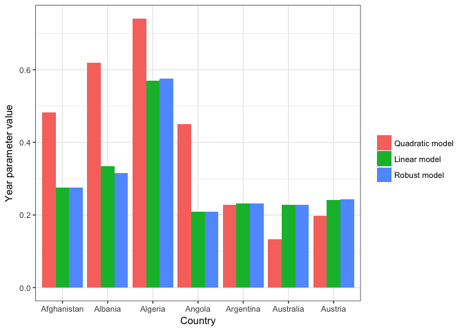

Writing functions and working with nested dataframes
================

2. Writing Functions
--------------------

I'll stick with gapminder for this exercise.

``` r
suppressPackageStartupMessages(library(tidyverse))
suppressPackageStartupMessages(library(MASS))
library(listviewer)
library(broom)
library(knitr)
suppressPackageStartupMessages(library(reshape2))
library(gapminder)
```

Just to remind myself of what it looks like:

``` r
kable(head(gapminder))
```

| country     | continent |  year|  lifeExp|       pop|  gdpPercap|
|:------------|:----------|-----:|--------:|---------:|----------:|
| Afghanistan | Asia      |  1952|   28.801|   8425333|   779.4453|
| Afghanistan | Asia      |  1957|   30.332|   9240934|   820.8530|
| Afghanistan | Asia      |  1962|   31.997|  10267083|   853.1007|
| Afghanistan | Asia      |  1967|   34.020|  11537966|   836.1971|
| Afghanistan | Asia      |  1972|   36.088|  13079460|   739.9811|
| Afghanistan | Asia      |  1977|   38.438|  14880372|   786.1134|

**1. A linear model**

I will write a basic function to fit a linear model for the relationship between life expectancy and year. As suggested by Jenny in her [tutorial](http://stat545.com/block012_function-regress-lifeexp-on-year.html), I will force the intercept to start at the first year in the gapminder data (1952) not the first year ever (0) using an offset.

``` r
lm_fit <- function(mydata, offset=1952) {
  the_lm <- lm(lifeExp ~ I(year-offset), data=mydata)
    coef(the_lm)
}
```

Let's see if it works on gapminder:

``` r
lm_fit(gapminder)
```

    ##      (Intercept) I(year - offset) 
    ##       50.5120841        0.3259038

It seems like the function is working, but I'll do a quick sanity check.

``` r
lm(lifeExp ~ I(year-1952), gapminder)
```

    ## 
    ## Call:
    ## lm(formula = lifeExp ~ I(year - 1952), data = gapminder)
    ## 
    ## Coefficients:
    ##    (Intercept)  I(year - 1952)  
    ##        50.5121          0.3259

Looks good! Now what about using the function on a single country within the gapminder data?

``` r
gapminder %>%
  filter(country=="France") %>%
      lm_fit()
```

    ##      (Intercept) I(year - offset) 
    ##       67.7901282        0.2385014

That's good for now, but in the next exercise I'll automate this task in order to fit a linear model for each country without have to repeat the above command hundreds of times.

However, I would also like to be able to fit a couple different types of models, such as:

**2. A quadratic model**

I'll include a squared term for year to account for potential non-linearity in the change in life expectancy over time.

``` r
quad_fit <- function(mydata, offset=1952) {
  the_quad <- lm(lifeExp ~ I(year-offset) + I((year-offset)^2), data=mydata)
    coef(the_quad)
}

quad_fit(gapminder)
```

    ##          (Intercept)     I(year - offset) I((year - offset)^2) 
    ##         48.916137600          0.517417408         -0.003482065

**3. A robust regression model**

``` r
robust_fit <- function(mydata, offset=1952, method="M") {
  the_robust <- MASS::rlm(lifeExp ~ I(year-offset), method=method, data=mydata)
    coef(the_robust)
}

robust_fit(gapminder)
```

    ##      (Intercept) I(year - offset) 
    ##        50.399200         0.335076

This method produces very similar coefficients as the linear model, but robust regression using M-estimation will be less influenced by outliers in life expectancy, so there will probably be bigger differences for certain countries.

Now I want to apply these functions to nested dataframes consisting of the countries in gapminder.

6. Working with nested dataframes
---------------------------------

First, I will **nest the data by continent and country**

``` r
gap_nested <- gapminder %>% 
   group_by(continent, country) %>% 
   nest()

kable(head(gap_nested))
```

| continent | country     | data                                                                                                                                                                                                                                                                                                                                                                                                                                                                                                                                                                                                                                                                                           |
|:----------|:------------|:-----------------------------------------------------------------------------------------------------------------------------------------------------------------------------------------------------------------------------------------------------------------------------------------------------------------------------------------------------------------------------------------------------------------------------------------------------------------------------------------------------------------------------------------------------------------------------------------------------------------------------------------------------------------------------------------------|
| Asia      | Afghanistan | 1.952000e+03, 1.957000e+03, 1.962000e+03, 1.967000e+03, 1.972000e+03, 1.977000e+03, 1.982000e+03, 1.987000e+03, 1.992000e+03, 1.997000e+03, 2.002000e+03, 2.007000e+03, 2.880100e+01, 3.033200e+01, 3.199700e+01, 3.402000e+01, 3.608800e+01, 3.843800e+01, 3.985400e+01, 4.082200e+01, 4.167400e+01, 4.176300e+01, 4.212900e+01, 4.382800e+01, 8.425333e+06, 9.240934e+06, 1.026708e+07, 1.153797e+07, 1.307946e+07, 1.488037e+07, 1.288182e+07, 1.386796e+07, 1.631792e+07, 2.222742e+07, 2.526840e+07, 3.188992e+07, 7.794453e+02, 8.208530e+02, 8.531007e+02, 8.361971e+02, 7.399811e+02, 7.861134e+02, 9.780114e+02, 8.523959e+02, 6.493414e+02, 6.353414e+02, 7.267341e+02, 9.745803e+02 |
| Europe    | Albania     | 1952.000, 1957.000, 1962.000, 1967.000, 1972.000, 1977.000, 1982.000, 1987.000, 1992.000, 1997.000, 2002.000, 2007.000, 55.230, 59.280, 64.820, 66.220, 67.690, 68.930, 70.420, 72.000, 71.581, 72.950, 75.651, 76.423, 1282697.000, 1476505.000, 1728137.000, 1984060.000, 2263554.000, 2509048.000, 2780097.000, 3075321.000, 3326498.000, 3428038.000, 3508512.000, 3600523.000, 1601.056, 1942.284, 2312.889, 2760.197, 3313.422, 3533.004, 3630.881, 3738.933, 2497.438, 3193.055, 4604.212, 5937.030                                                                                                                                                                                     |
| Africa    | Algeria     | 1952.000, 1957.000, 1962.000, 1967.000, 1972.000, 1977.000, 1982.000, 1987.000, 1992.000, 1997.000, 2002.000, 2007.000, 43.077, 45.685, 48.303, 51.407, 54.518, 58.014, 61.368, 65.799, 67.744, 69.152, 70.994, 72.301, 9279525.000, 10270856.000, 11000948.000, 12760499.000, 14760787.000, 17152804.000, 20033753.000, 23254956.000, 26298373.000, 29072015.000, 31287142.000, 33333216.000, 2449.008, 3013.976, 2550.817, 3246.992, 4182.664, 4910.417, 5745.160, 5681.359, 5023.217, 4797.295, 5288.040, 6223.367                                                                                                                                                                          |
| Africa    | Angola      | 1952.000, 1957.000, 1962.000, 1967.000, 1972.000, 1977.000, 1982.000, 1987.000, 1992.000, 1997.000, 2002.000, 2007.000, 30.015, 31.999, 34.000, 35.985, 37.928, 39.483, 39.942, 39.906, 40.647, 40.963, 41.003, 42.731, 4232095.000, 4561361.000, 4826015.000, 5247469.000, 5894858.000, 6162675.000, 7016384.000, 7874230.000, 8735988.000, 9875024.000, 10866106.000, 12420476.000, 3520.610, 3827.940, 4269.277, 5522.776, 5473.288, 3008.647, 2756.954, 2430.208, 2627.846, 2277.141, 2773.287, 4797.231                                                                                                                                                                                   |
| Americas  | Argentina   | 1952.000, 1957.000, 1962.000, 1967.000, 1972.000, 1977.000, 1982.000, 1987.000, 1992.000, 1997.000, 2002.000, 2007.000, 62.485, 64.399, 65.142, 65.634, 67.065, 68.481, 69.942, 70.774, 71.868, 73.275, 74.340, 75.320, 17876956.000, 19610538.000, 21283783.000, 22934225.000, 24779799.000, 26983828.000, 29341374.000, 31620918.000, 33958947.000, 36203463.000, 38331121.000, 40301927.000, 5911.315, 6856.856, 7133.166, 8052.953, 9443.039, 10079.027, 8997.897, 9139.671, 9308.419, 10967.282, 8797.641, 12779.380                                                                                                                                                                      |
| Oceania   | Australia   | 1952.000, 1957.000, 1962.000, 1967.000, 1972.000, 1977.000, 1982.000, 1987.000, 1992.000, 1997.000, 2002.000, 2007.000, 69.120, 70.330, 70.930, 71.100, 71.930, 73.490, 74.740, 76.320, 77.560, 78.830, 80.370, 81.235, 8691212.000, 9712569.000, 10794968.000, 11872264.000, 13177000.000, 14074100.000, 15184200.000, 16257249.000, 17481977.000, 18565243.000, 19546792.000, 20434176.000, 10039.596, 10949.650, 12217.227, 14526.125, 16788.629, 18334.198, 19477.009, 21888.889, 23424.767, 26997.937, 30687.755, 34435.367                                                                                                                                                               |

That 'data' column looks pretty crazy, let's see what's in the first position of the data column.

``` r
kable(gap_nested[[1, "data"]])
```

|  year|  lifeExp|       pop|  gdpPercap|
|-----:|--------:|---------:|----------:|
|  1952|   28.801|   8425333|   779.4453|
|  1957|   30.332|   9240934|   820.8530|
|  1962|   31.997|  10267083|   853.1007|
|  1967|   34.020|  11537966|   836.1971|
|  1972|   36.088|  13079460|   739.9811|
|  1977|   38.438|  14880372|   786.1134|
|  1982|   39.854|  12881816|   978.0114|
|  1987|   40.822|  13867957|   852.3959|
|  1992|   41.674|  16317921|   649.3414|
|  1997|   41.763|  22227415|   635.3414|
|  2002|   42.129|  25268405|   726.7341|
|  2007|   43.828|  31889923|   974.5803|

Looks like it's a list of all the normal gapminder data, including life expectancy and year. This is going to make it a lot easier to **run my functions on the trend in life expectancy for each country**. I'll try that now, but just for France. First I need to see the position of France in gap\_nested.

``` r
listviewer::jsonedit(gap_nested$country, mode = "view")
```

<!--html_preserve-->

<script type="application/json" data-for="htmlwidget-00034dc1892ac1140c3e">{"x":{"data":["Afghanistan","Albania","Algeria","Angola","Argentina","Australia","Austria","Bahrain","Bangladesh","Belgium","Benin","Bolivia","Bosnia and Herzegovina","Botswana","Brazil","Bulgaria","Burkina Faso","Burundi","Cambodia","Cameroon","Canada","Central African Republic","Chad","Chile","China","Colombia","Comoros","Congo, Dem. Rep.","Congo, Rep.","Costa Rica","Cote d'Ivoire","Croatia","Cuba","Czech Republic","Denmark","Djibouti","Dominican Republic","Ecuador","Egypt","El Salvador","Equatorial Guinea","Eritrea","Ethiopia","Finland","France","Gabon","Gambia","Germany","Ghana","Greece","Guatemala","Guinea","Guinea-Bissau","Haiti","Honduras","Hong Kong, China","Hungary","Iceland","India","Indonesia","Iran","Iraq","Ireland","Israel","Italy","Jamaica","Japan","Jordan","Kenya","Korea, Dem. Rep.","Korea, Rep.","Kuwait","Lebanon","Lesotho","Liberia","Libya","Madagascar","Malawi","Malaysia","Mali","Mauritania","Mauritius","Mexico","Mongolia","Montenegro","Morocco","Mozambique","Myanmar","Namibia","Nepal","Netherlands","New Zealand","Nicaragua","Niger","Nigeria","Norway","Oman","Pakistan","Panama","Paraguay","Peru","Philippines","Poland","Portugal","Puerto Rico","Reunion","Romania","Rwanda","Sao Tome and Principe","Saudi Arabia","Senegal","Serbia","Sierra Leone","Singapore","Slovak Republic","Slovenia","Somalia","South Africa","Spain","Sri Lanka","Sudan","Swaziland","Sweden","Switzerland","Syria","Taiwan","Tanzania","Thailand","Togo","Trinidad and Tobago","Tunisia","Turkey","Uganda","United Kingdom","United States","Uruguay","Venezuela","Vietnam","West Bank and Gaza","Yemen, Rep.","Zambia","Zimbabwe"],"options":{"mode":"view","modes":["code","form","text","tree","view"]}},"evals":[],"jsHooks":[]}</script>
<!--/html_preserve-->
Using listviewer, it looks like France is in the 44th position, but when I ran my lm\_fit function below I was getting slightly different coefficients that when I used lm\_fit on the unnested gapminder dataset (piped to only include France) a shown above. However, the coefficients are identifical when I run lm\_fit on the dataframe in the 45th postion of the 'data' list, so that must be where it is.

*Note: I can only knit the markdown file if I allow it to produce the listviewer output in html format. The html code is nonsensical and doesn't show the reader what I'm able to see. Any suggestions?*

``` r
map(gap_nested$data[45], lm_fit)
```

    ## [[1]]
    ##      (Intercept) I(year - offset) 
    ##       67.7901282        0.2385014

This difference is probably because the first country (Afghanistan) is listed as row 0 in listviewer, and row 1 in the dataframe. But this really isn't an ideal way to find France's position so I also played around with str() and map() to try and find France by name (see code below). I was looking at Jenny's purrr [tutorial](https://jennybc.github.io/purrr-tutorial/ls02_map-extraction-advanced.html) but couldn't find the solution. There doesn't appear to be anything in the data list that identifies country by name, only by it's position in the gap\_nested dataframe. Please help!

``` r
# str(gap_nested, max.level=1, list.length=1)
# map(gap_nested$data, "France")
```

But carrying on, mapping my linear regression function to one country in the data list does seem to be working. I'll try doing it with all countries and add the coefficients as another list in the gap\_nested datframe.

**1. A linear model**

``` r
gap_nested <- gap_nested %>% 
   mutate(fit.lm = map(data, lm_fit))

gap_nested$fit.lm[[45]]
```

    ##      (Intercept) I(year - offset) 
    ##       67.7901282        0.2385014

Great, it looks like I still get the same answer for France when I run the lm\_fit function on every country in gap\_nested. But now I'd like to **tidy up** the lm output using the broom package.

``` r
gap_nested <- gap_nested %>% 
  mutate(tidy.lm = map(fit.lm, tidy))

gap_nested$tidy.lm[[45]]
```

    ## # A tibble: 2 x 2
    ##              names          x
    ##              <chr>      <dbl>
    ## 1      (Intercept) 67.7901282
    ## 2 I(year - offset)  0.2385014

Same output for France, but now the coefficients are in a dataframe. Now I'll **unnest** the dataframe and keep the coefficients for each country as a proof of principle.

``` r
gap_coefs <- gap_nested %>% 
   dplyr::select(continent, country, tidy.lm) %>% 
   unnest(tidy.lm)  %>%
    dplyr::rename(parameter=names, coefficient.lm=x)

kable(head(gap_coefs))
```

| continent | country     | parameter        |  coefficient.lm|
|:----------|:------------|:-----------------|---------------:|
| Asia      | Afghanistan | (Intercept)      |      29.9072949|
| Asia      | Afghanistan | I(year - offset) |       0.2753287|
| Europe    | Albania     | (Intercept)      |      59.2291282|
| Europe    | Albania     | I(year - offset) |       0.3346832|
| Africa    | Algeria     | (Intercept)      |      43.3749744|
| Africa    | Algeria     | I(year - offset) |       0.5692797|

Cool:punch: Now, I can fit coefficients for other models and **compare the output**. I'll go back to working with the nested dataframe in order to add the fitted and tidy coefficients for the other models, and then I'll unnest again at the very end.

**2. A quadratic model**

``` r
gap_nested <- gap_nested %>% 
                 mutate(fit.qm = map(data, quad_fit),
                   tidy.qm = map(fit.qm, tidy))
head(gap_nested)
```

    ## # A tibble: 6 x 7
    ##   continent     country              data    fit.lm          tidy.lm
    ##      <fctr>      <fctr>            <list>    <list>           <list>
    ## 1      Asia Afghanistan <tibble [12 x 4]> <dbl [2]> <tibble [2 x 2]>
    ## 2    Europe     Albania <tibble [12 x 4]> <dbl [2]> <tibble [2 x 2]>
    ## 3    Africa     Algeria <tibble [12 x 4]> <dbl [2]> <tibble [2 x 2]>
    ## 4    Africa      Angola <tibble [12 x 4]> <dbl [2]> <tibble [2 x 2]>
    ## 5  Americas   Argentina <tibble [12 x 4]> <dbl [2]> <tibble [2 x 2]>
    ## 6   Oceania   Australia <tibble [12 x 4]> <dbl [2]> <tibble [2 x 2]>
    ## # ... with 2 more variables: fit.qm <list>, tidy.qm <list>

**3. A robust regression model**

``` r
gap_nested <- gap_nested %>% 
                 mutate(fit.rm = map(data, robust_fit),
                   tidy.rm = map(fit.rm, tidy))
```

    ## Warning in rlm.default(x, y, weights, method = method, wt.method =
    ## wt.method, : 'rlm' failed to converge in 20 steps

    ## Warning in rlm.default(x, y, weights, method = method, wt.method =
    ## wt.method, : 'rlm' failed to converge in 20 steps

    ## Warning in rlm.default(x, y, weights, method = method, wt.method =
    ## wt.method, : 'rlm' failed to converge in 20 steps

``` r
head(gap_nested)
```

    ## # A tibble: 6 x 9
    ##   continent     country              data    fit.lm          tidy.lm
    ##      <fctr>      <fctr>            <list>    <list>           <list>
    ## 1      Asia Afghanistan <tibble [12 x 4]> <dbl [2]> <tibble [2 x 2]>
    ## 2    Europe     Albania <tibble [12 x 4]> <dbl [2]> <tibble [2 x 2]>
    ## 3    Africa     Algeria <tibble [12 x 4]> <dbl [2]> <tibble [2 x 2]>
    ## 4    Africa      Angola <tibble [12 x 4]> <dbl [2]> <tibble [2 x 2]>
    ## 5  Americas   Argentina <tibble [12 x 4]> <dbl [2]> <tibble [2 x 2]>
    ## 6   Oceania   Australia <tibble [12 x 4]> <dbl [2]> <tibble [2 x 2]>
    ## # ... with 4 more variables: fit.qm <list>, tidy.qm <list>, fit.rm <list>,
    ## #   tidy.rm <list>

Now I can do the final **unnesting**. But I'm going to need to do it in two parts because the linear and robust models have 2 parameters, but the quadratic model has 3 parameters, so I won't be able to put them all in the same unnested dataframe without some re-jigging.

First, I'll unnest the linear and robust model parameters.

``` r
(gap_nested_lm_rm <-  gap_nested %>%
                        dplyr::select(continent, country, tidy.lm, tidy.qm, tidy.rm) %>% 
                          unnest(tidy.lm, tidy.rm) %>%
                             dplyr::select(-names1) %>%
                                dplyr::rename(parameter=names, coefficient.lm=x, coefficient.rm=x1))
```

    ## # A tibble: 284 x 5
    ##    continent     country        parameter coefficient.lm coefficient.rm
    ##       <fctr>      <fctr>            <chr>          <dbl>          <dbl>
    ##  1      Asia Afghanistan      (Intercept)     29.9072949     29.9072949
    ##  2      Asia Afghanistan I(year - offset)      0.2753287      0.2753287
    ##  3    Europe     Albania      (Intercept)     59.2291282     59.9416820
    ##  4    Europe     Albania I(year - offset)      0.3346832      0.3160949
    ##  5    Africa     Algeria      (Intercept)     43.3749744     43.1580026
    ##  6    Africa     Algeria I(year - offset)      0.5692797      0.5758313
    ##  7    Africa      Angola      (Intercept)     32.1266538     32.1349259
    ##  8    Africa      Angola I(year - offset)      0.2093399      0.2090313
    ##  9  Americas   Argentina      (Intercept)     62.6884359     62.6550784
    ## 10  Americas   Argentina I(year - offset)      0.2317084      0.2327136
    ## # ... with 274 more rows

Now I'll unnest the quadratic model.

``` r
 (gap_nested_qm <- gap_nested %>%
                    dplyr::select(continent, country, tidy.qm) %>% 
                       unnest(tidy.qm) %>%
                         dplyr::rename(parameter=names, coefficient.qm=x))
```

    ## # A tibble: 426 x 4
    ##    continent     country            parameter coefficient.qm
    ##       <fctr>      <fctr>                <chr>          <dbl>
    ##  1      Asia Afghanistan          (Intercept)   28.178686813
    ##  2      Asia Afghanistan     I(year - offset)    0.482761638
    ##  3      Asia Afghanistan I((year - offset)^2)   -0.003771508
    ##  4    Europe     Albania          (Intercept)   56.853134615
    ##  5    Europe     Albania     I(year - offset)    0.619802448
    ##  6    Europe     Albania I((year - offset)^2)   -0.005183986
    ##  7    Africa     Algeria          (Intercept)   41.942236264
    ##  8    Africa     Algeria     I(year - offset)    0.741208292
    ##  9    Africa     Algeria I((year - offset)^2)   -0.003125974
    ## 10    Africa      Angola          (Intercept)   30.117670330
    ## # ... with 416 more rows

Now I will used a **full join** to merge the dataframes while retaining three parameters for each country.

``` r
gap_full_coeff <- left_join(gap_nested_qm, gap_nested_lm_rm)
```

    ## Joining, by = c("continent", "country", "parameter")

``` r
kable(head(gap_full_coeff))
```

| continent | country     | parameter            |  coefficient.qm|  coefficient.lm|  coefficient.rm|
|:----------|:------------|:---------------------|---------------:|---------------:|---------------:|
| Asia      | Afghanistan | (Intercept)          |      28.1786868|      29.9072949|      29.9072949|
| Asia      | Afghanistan | I(year - offset)     |       0.4827616|       0.2753287|       0.2753287|
| Asia      | Afghanistan | I((year - offset)^2) |      -0.0037715|              NA|              NA|
| Europe    | Albania     | (Intercept)          |      56.8531346|      59.2291282|      59.9416820|
| Europe    | Albania     | I(year - offset)     |       0.6198024|       0.3346832|       0.3160949|
| Europe    | Albania     | I((year - offset)^2) |      -0.0051840|              NA|              NA|

Got it:smile: Finally, I will **visualize the differences** in the year coefficient for countries. I'll need to reshape and rearrange the data to do that. I'm not going to be able to fit all 142 countries on the same graph, so I'll just look at the first 7 for exploration purposes.

``` r
gap_year_coeff <- gap_full_coeff %>% 
                    filter(parameter=="I(year - offset)") 

gap_year_coeff_melt <- melt(gap_year_coeff, id=c("continent","country","parameter"))
gap_year_coeff_melt <- arrange(gap_year_coeff_melt, country)
head(gap_year_coeff_melt)
```

    ##   continent     country        parameter       variable     value
    ## 1      Asia Afghanistan I(year - offset) coefficient.qm 0.4827616
    ## 2      Asia Afghanistan I(year - offset) coefficient.lm 0.2753287
    ## 3      Asia Afghanistan I(year - offset) coefficient.rm 0.2753287
    ## 4    Europe     Albania I(year - offset) coefficient.qm 0.6198024
    ## 5    Europe     Albania I(year - offset) coefficient.lm 0.3346832
    ## 6    Europe     Albania I(year - offset) coefficient.rm 0.3160949

``` r
ggplot(gap_year_coeff_melt[1:21,], aes(x=country, y=value, fill=variable)) + 
      geom_bar(position="dodge", stat="identity") +
        ylab("Year parameter value") + xlab("Country") +
          scale_fill_discrete(name="", labels=c("Quadratic model","Linear model","Robust model")) + 
          theme_bw()
```



I can see that the coefficients for the year parameter are quite similar for the linear and robust models, and quite different for the quadratic model, just as I'd expect. Unfortunately I'm out of time, but there are a few obvious **next steps** that I'd like to do in the future:

-   Write a function to find the differences in the year coefficients between the quadratic model and the average of the linear and robust models. This would give me an idea of the countries in which there is probably a non-linear term because the squared year term is really affecting the model parameters.
-   Write a function to calculate the difference between the year coefficients for the linear and robust models for each country. This would give me an idea of which countries have outliers, as these models tend to diverge in the presence of outliers. I would go back to the nested dataframe to run both of these functions.
-   Extract the standard errors and p-values for each of the models to compare them. I think the broom package would make it relatively easy to do this.
-   *Any other suggestions?*

**Final thoughts**

I found that there was quite a bit of overhead in nesting the data, and I still find those lists very unwieldy, but once it was in the correct format it was very easy to map the functions to the dataframe for each country. I think I just need to find a better system for viewing the components of lists. In the past I've use 'dlply' and some pretty complicated 'for' loops to accomplish these tasks, and I *think* this is easier, although maybe less intuitive.
