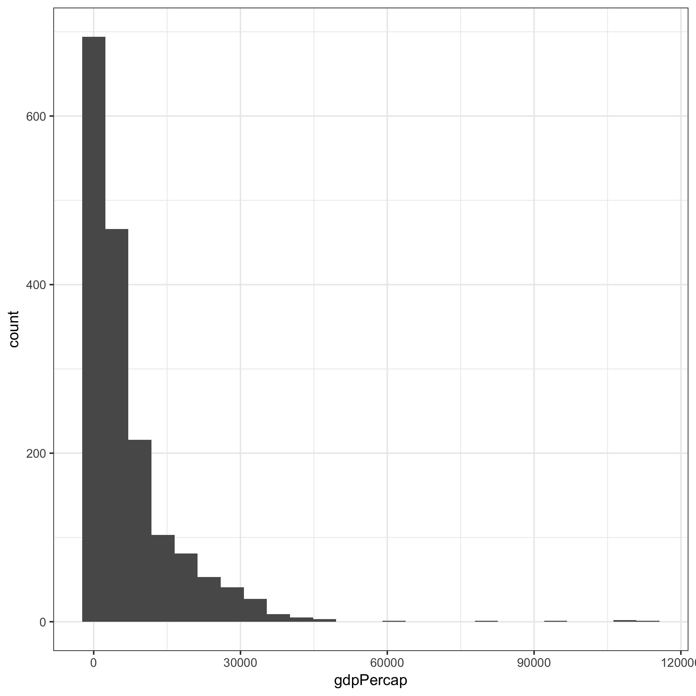
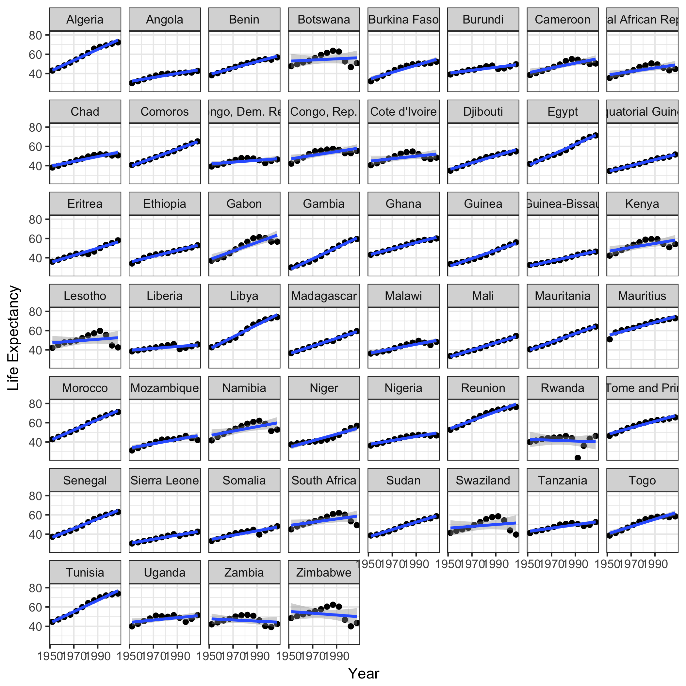
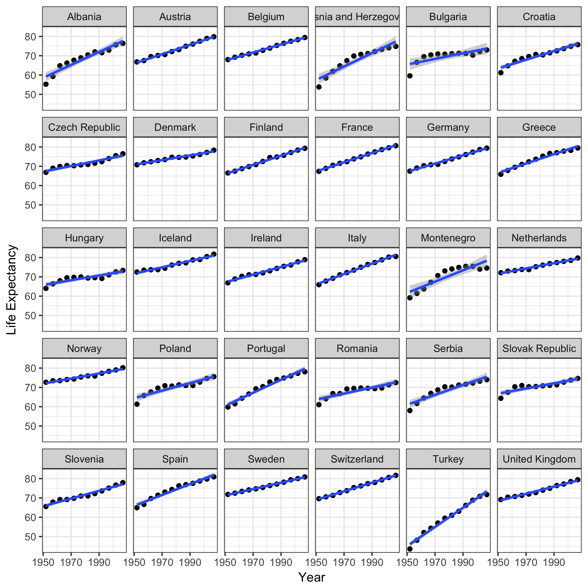
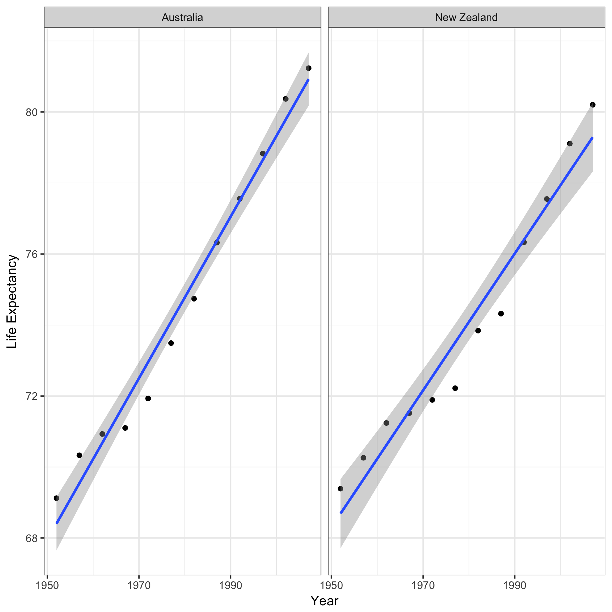

```{r, echo=FALSE, message=FALSE}
library(tidyverse)
library(knitr)
```


## Data Exploration


**Figure 1: Histogram of life expectancy.**



**Figure 2: Historgram of per capita GDP.**


```{r, echo=FALSE}
kable(gap.worst)
```

**Table 1: Coefficients from linear models of countries with declining life expectancy.**

```{r, echo=FALSE}
kable(gap.worst)
```

**Table 2: Coefficients from linear models of countries with life expectancy increasing at the fastest rate.**

## Life Expectancy over Time


**Figure 3: Life expectancy for all countries in Asia from 1953-2007.**



**Figure 4: Life expectancy for all countries in Africa from 1953-2007.**


**Figure 5: Life expectancy for all countries in the Americas from 1953-2007.**



**Figure 6: Life expectancy for all countries in Europe from 1953-2007.**



**Figure 7: Life expectancy for all countries in Oceania from 1953-2007.**