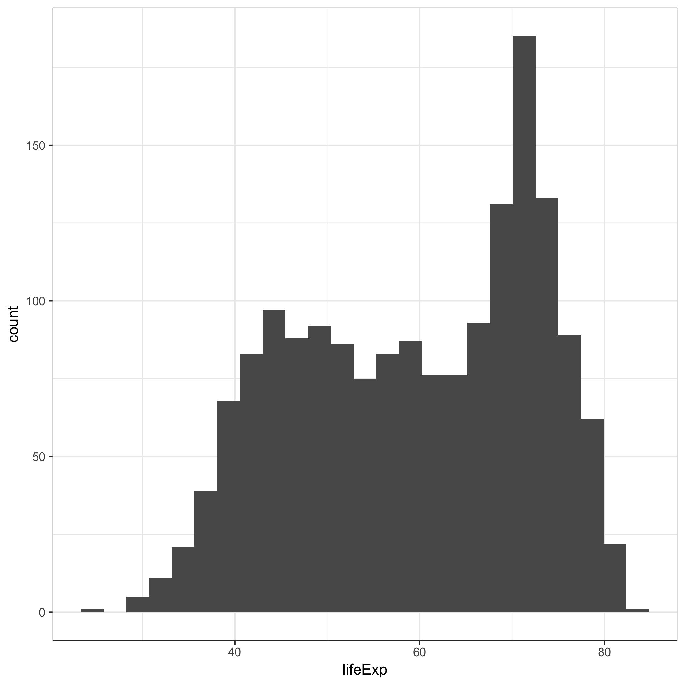

Plots from Gapminder Exploration
================

Data Exploration
----------------

**Figure 1: Histogram of life expectancy.**

**Figure 2: Historgram of per capita GDP.**

| continent | country  | term             |    estimate|  std.error|   statistic|    p.value|
|:----------|:---------|:-----------------|-----------:|----------:|-----------:|----------:|
| Africa    | Zimbabwe | I(year - offset) |  -0.0930210|  0.1205097|  -0.7718963|  0.4580290|
| Africa    | Zambia   | I(year - offset) |  -0.0604252|  0.0757420|  -0.7977764|  0.4435318|
| Africa    | Rwanda   | I(year - offset) |  -0.0458315|  0.1096860|  -0.4178424|  0.6848927|

**Table 1: Coefficients from linear models of countries with declining life expectancy.**

| continent | country  | term             |    estimate|  std.error|   statistic|    p.value|
|:----------|:---------|:-----------------|-----------:|----------:|-----------:|----------:|
| Africa    | Zimbabwe | I(year - offset) |  -0.0930210|  0.1205097|  -0.7718963|  0.4580290|
| Africa    | Zambia   | I(year - offset) |  -0.0604252|  0.0757420|  -0.7977764|  0.4435318|
| Africa    | Rwanda   | I(year - offset) |  -0.0458315|  0.1096860|  -0.4178424|  0.6848927|

**Table 2: Coefficients from linear models of countries with life expectancy increasing at the fastest rate.**

Life Expectancy over Time
-------------------------

**Figure 3: Life expectancy for all countries in Asia from 1953-2007.**

**Figure 4: Life expectancy for all countries in Africa from 1953-2007.**

**Figure 5: Life expectancy for all countries in the Americas from 1953-2007.**

**Figure 6: Life expectancy for all countries in Europe from 1953-2007.**

**Figure 7: Life expectancy for all countries in Oceania from 1953-2007.**
